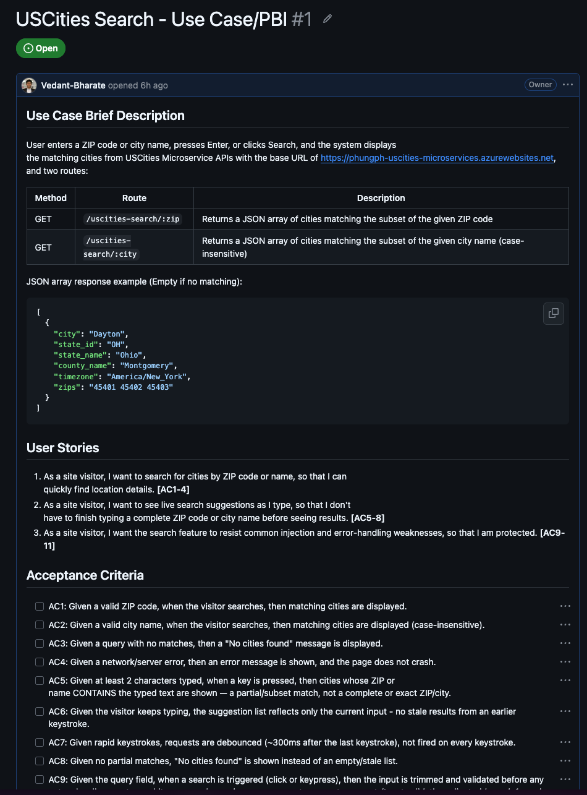
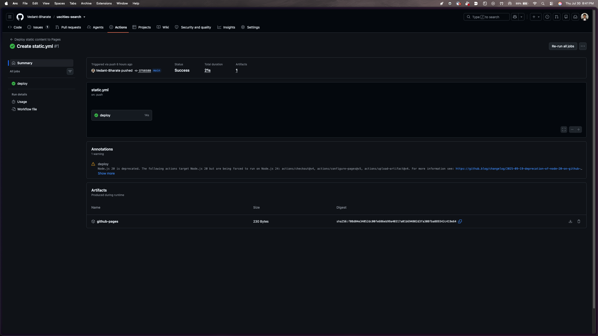
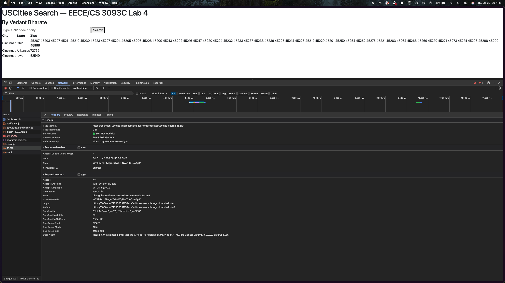
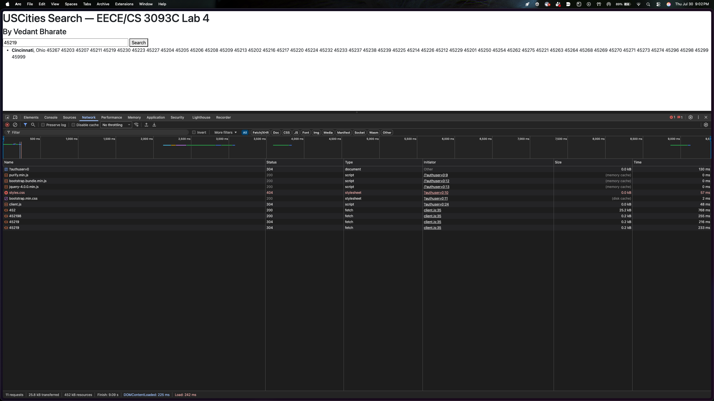

# Lab 4 — Microservices Development with Cloud MongoDB Database and Docker Deployment

**Course:** EECE/CS 3093C Software Engineering, Summer 2026  
**Instructor:** Dr. Phu Phung  
**Student:** Vedant Bharate (bharatva@mail.uc.edu)    
**GitHub Repository:** https://github.com/Vedant-Bharate/uscities-search  
**Production URL (GitHub Pages):** https://vedant-bharate.github.io/uscities-search *(Update if different)*    
**Microservice API URL:** https://bharatva-uscities-microservices-dsa9d4apcwfaaqg9.westus3-01.azurewebsites.net   

---

## Introduction

This lab involves the development and deployment of a City Search application utilizing a microservices architecture. Following the completion of the backend microservice RESTful API deployed via Docker to Azure App Services (Task 1), Task 2 focuses on front-end development and CI/CD. The front-end is designed as a static UI that consumes the live JSON data from the backend microservice via asynchronous `fetch` requests without reloading the page. The static site is deployed using GitHub Pages and GitHub Actions.

---

## Task 2.a — Repository Setup & Software Artifacts

### Step 1 — SSDLC: GitHub Issue Before Coding

Before writing code, the system analysis and design were documented as a Product Backlog Item (PBI) via a GitHub Issue. This established the requirements for the microservice integration, detailing the expected request/response formats and defining robust edge-case handling.

**Issue #1 — Use-Case: City Search via Microservice:** https://github.com/Vedant-Bharate/uscities-search/issues/1

**Screenshot 2.a.1 — GitHub Issue showing user stories, ACs, and sequence diagram:**



#### Use-Case: City Search — Acceptance Criteria

| AC | Description |
|---|---|
| AC-1 | Valid inputs (city name or zip code) return and display a sanitized list of matching city data. |
| AC-2 | The application handles instant live requests without requiring the user to press "Enter" or click a search button. |
| AC-3 | If no matches are found, an explicit "No cities found" message is displayed instead of an empty screen. |
| AC-4 | The application fails safely if the microservice returns a non-200 status (e.g., catching response errors). |
| AC-5 | The instant search triggers only when at least 2 characters have been typed. |
| AC-6 | Rapid keystrokes are debounced (approx. 300ms delay) to prevent spamming the backend microservice API. |
| AC-7 | All JSON data fields are strictly sanitized before being rendered into the HTML DOM to prevent Cross-Site Scripting (XSS). |

### Step 2 — GitHub Pages and Actions Setup

A new public repository was created and configured to deploy a static HTML site using GitHub Actions. The `static.yml` workflow file was committed to the repository, establishing the CI/CD pipeline so that any pushes to the `main` branch automatically deploy the front-end to GitHub Pages.

**Screenshot 2.a.2 — GitHub Actions workflow succeeding and deploying to Pages:**



---

## Task 2.b — Front-end Development & CI/CD

### Task 2.b.i — Microservices Integration and Testing

The core integration relies on native JavaScript asynchronous web features. An `async` function was implemented using the `await fetch()` methodology to send HTTP GET requests to the external Azure microservice. The response is verified for successful status codes before attempting to parse the JSON data. 

```javascript
const BASE_URL = "https://<YOUR-AZURE-APP-NAME>.azurewebsites.net"; // Update URL

async function search() {
  const query = searchInput.value.trim();
  if (!query) return; 
  
  try {
    const response = await fetch(`${BASE_URL}/uscities-search/${encodeURIComponent(query)}`);
    if (!response.ok) {
      throw new Error(`Unexpected status ${response.status}`);
    }
    const data = await response.json();
    
    if (!Array.isArray(data)) {
      throw new Error('Malformed response');
    }
    displaySearch(data);
  } catch (err) {
    console.log(`Debug>search error: ${err.message}`);
    responsesElm.innerHTML = '<span style="color:red;">Error: could not load results.</span>';
  }
}

### Task 2.b.ii — Handling JSON Data and Security (Sanitization)

Displaying raw JSON is not user-friendly. The `displaySearch()` function was written to map the returned JSON array objects into a structured HTML table. 

From a security standpoint, data from an external API cannot be implicitly trusted before being rendered into the Document Object Model (DOM). `DOMPurify` was integrated to sanitize all JSON fields (City, State, Zips) prior to HTML concatenation.

```javascript
// Sanitize every field before it is rendered as HTML using DOMPurify
function data_sanitize(v) {
  return DOMPurify.sanitize(typeof v === 'string' ? v : '');
}

function displaySearch(data) {
  if (!Array.isArray(data) || data.length === 0) {
    responsesElm.innerHTML = "<strong>No cities found</strong>";
    return;
  }
  
  var rows = data.map(function (c) {
    return "<tr><td>" + data_sanitize(c.city) + "</td><td>" + 
           data_sanitize(c.state_name) + "</td><td>" + 
           data_sanitize(c.zips) + "</td></tr>";
  }).join('');
  
  responsesElm.innerHTML = "<table><tr><th>City</th><th>State</th><th>Zips</th></tr>" + rows + "</table>";
}
```

**Screenshot 2.b.ii — JSON data formatted as an HTML table:**



### Task 2.b.iii — Handling Live/Instant Requests

To improve user experience and mirror features like Google search hints, a `keyup` event listener was attached to the input field. To protect the microservice from being overwhelmed by API calls on every single keystroke, two defensive programming strategies were utilized:
1. **Minimum Length:** The API request is aborted if the input is less than 2 characters long.
2. **Debouncing:** A `setTimeout` of 300ms is used. If the user types another key within 300ms, the previous timer is cleared, ensuring the `fetch` request only fires when the user pauses typing.

```javascript
var debounceTimer = null;

searchInput.addEventListener('keyup', function (event) {
  if (event.key === 'Enter') {
    clearTimeout(debounceTimer);
    search();
    searchInput.value = ''; // clear field after explicit search
    return;
  }

  clearTimeout(debounceTimer);
  var query = searchInput.value.trim();
  
  if (query.length < 2) return; // Need at least 2 characters before suggesting
  
  // Debounce ~300ms after the last keystroke
  debounceTimer = setTimeout(search, 300); 
});
```


---

## Deliverables Summary

| Item | Status |
|---|---|
| Task 2.a.i: GitHub Pages with Actions setup | Done |
| Task 2.a.ii: Software artifacts (PBI, ACs, Sequence Diagram) | Done |
| Task 2.b.i: Microservices integration with `fetch()` | Done |
| Task 2.b.ii: JSON parsing and DOMPurify sanitization | Done |
| Task 2.b.iii: Live requests with debouncing implementation | Done |
| CI/CD: Successful automatic deploy to GitHub Pages | Done |
| Microservice Azure App | https://<YOUR-AZURE-APP-NAME>.azurewebsites.net |
| Front-end GitHub Pages App | https://vedant-bharate.github.io/uscities-search |
